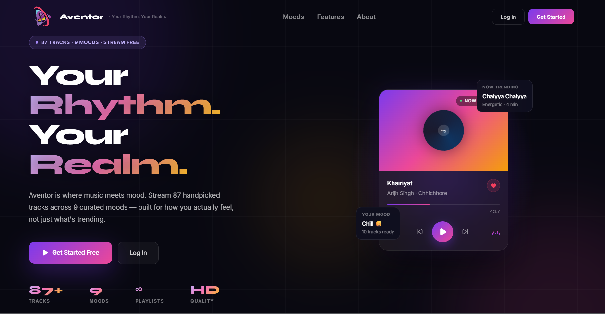

# 🎵 Aventor — Your Rhythm. Your Realm.

> A full-stack music streaming web application built with React.js, Redux Toolkit, and Supabase — featuring mood-based discovery, real-time audio playback, Google OAuth, and a fully responsive UI.

---

<!-- Replace the URL below with your actual deployed app screenshot -->


---

## 🔗 Live Demo

**[aventor.vercel.app](https://aventor-orpin.vercel.app/)** — Deployed on Vercel

---

## 📌 Table of Contents

- [Overview](#-overview)
- [Features](#-features)
- [Tech Stack](#-tech-stack)
- [Project Structure](#-project-structure)
- [Architecture](#-architecture)
- [Getting Started](#-getting-started)
- [Environment Variables](#-environment-variables)
- [Database Schema](#-database-schema)
- [Row Level Security](#-row-level-security)
- [Key Learnings](#-key-learnings)
- [Screenshots](#-screenshots)

---

## 🧠 Overview

Aventor is a **mood-based music streaming application** — not a Spotify clone, but an original product built from the ground up. Users can discover music across 9 curated moods, like songs, manage their profile, and enjoy a seamless audio experience with a persistent player bar.

This project was built as a **learning-first** endeavor — Supabase, Redux Toolkit, Google OAuth, browser-side image compression, and the HTML Audio API were all learned and implemented on the fly during development.

---

## ✨ Features

### 🔐 Authentication
- Email/Password Signup & Login via Supabase Auth
- **Continue with Google** (OAuth 2.0) — configured via Google Cloud Console
- Persistent sessions with automatic JWT token refresh
- Protected routes — public & private route guards

### 🎵 Music Player
- Persistent **PlayerBar** — survives page navigation (music never stops)
- **Full-screen player** with vinyl spinning animation
- Real-time **seek bar** — click any point to jump to that timestamp
- **Volume control** with mute/unmute toggle
- **Next / Previous** song navigation with queue support
- Repeat toggle

### 🎭 Mood-Based Discovery
- 9 curated moods — Happy, Sad, Energetic, Chill, Focus, Nostalgic, Intense, Workout, Romantic
- Each mood dynamically fetches songs filtered by genre

### ❤️ Liked Songs
- Like/Unlike any song — synced to Supabase in real-time
- Dedicated Liked Songs page with full song list
- Liked songs as a playable queue (next/prev works within liked songs)

### 👤 Profile Management
- Edit display name with live preview
- Upload & update profile picture
- **Client-side image compression** — avatars compressed to under 80KB before upload
- Bio with 30-word limit enforcement
- Join date, liked songs count, account status

### 🔍 Search
- Real-time search across song name, artist, and album
- Instant filtering — no API call on every keystroke

### 📱 Fully Responsive
- Sidebar collapses to icon-only mode on smaller screens
- Adaptive layouts for mobile, tablet, and desktop
- Dynamic window width tracking for fine-grained control

---

## 🛠 Tech Stack

| Category | Technology |
|---|---|
| Frontend Framework | React.js 18 |
| State Management | Redux Toolkit |
| Routing | React Router v6 |
| Backend as a Service | Supabase (PostgreSQL + Auth + Storage) |
| Styling | Tailwind CSS + Inline Styles |
| Package Manager | pnpm |
| Deployment | Vercel |
| Image Compression | browser-image-compression |
| Form Handling | React Hook Form |
| Icons | Lucide React |
| Build Tool | Vite |

---

## 📁 Project Structure

```
AVENTOR/
├── public/
│   ├── AventorLogo.png
│   └── google.svg
│
├── src/
│   ├── assets/                    # Static assets
│   │   ├── hero.png
│   │   ├── react.svg
│   │   └── vite.svg
│   │
│   ├── components/                # Reusable UI components
│   │   ├── ui/
│   │   │   └── button.jsx         # CVA-based Button component
│   │   └── lib/
│   │       └── utils.js           # cn() utility (clsx + tailwind-merge)
│   │
│   ├── pages/                     # Route-level pages
│   │   ├── AppHome.jsx            # Main app dashboard (songs grid)
│   │   ├── Home.jsx               # Public landing page
│   │   ├── LikedSongs.jsx         # User's liked songs
│   │   ├── Login.jsx              # Login page
│   │   ├── Moods.jsx              # Mood-based song discovery
│   │   ├── Profile.jsx            # User profile management
│   │   ├── SearchBar.jsx          # Search component
│   │   ├── Signup.jsx             # Signup page
│   │   └── SongCredential.jsx     # Individual song detail page
│   │
│   ├── reactComponents/           # Shared UI components
│   │   ├── FullPlayer.jsx         # Full-screen music player
│   │   ├── PlayerBar.jsx          # Persistent bottom player bar
│   │   ├── Sidebar.jsx            # Full + Compact sidebar
│   │   └── SongCard.jsx           # Song card component
│   │
│   ├── services/                  # API & service layer
│   │   ├── authService.js         # Auth operations (signup, login, OAuth)
│   │   ├── imageCompressionService.js  # Avatar compression + upload
│   │   ├── likedSongsService.js   # Like/unlike DB operations
│   │   ├── profileService.js      # Profile fetch + create
│   │   └── supabase.js            # Supabase client initialization
│   │
│   ├── store/                     # Redux store
│   │   ├── slices/
│   │   │   ├── authSlice.js       # User & session state
│   │   │   ├── likedSongsSlice.js # Liked IDs + toggleLike thunk
│   │   │   ├── playerSlice.js     # Audio playback state
│   │   │   ├── profileSlice.js    # Profile display state
│   │   │   └── songsSlice.js      # Songs library state
│   │   └── index.js               # configureStore
│   │
│   ├── App.jsx                    # Root component + routes + auth listener
│   ├── App.css
│   ├── main.jsx                   # ReactDOM render + Redux Provider
│   └── index.css
│
├── .env                           # Environment variables (gitignored)
├── .gitignore
├── index.html
├── jsconfig.json
├── package.json
├── pnpm-lock.yaml
├── vercel.json
└── vite.config.js
```

---

## 🏗 Architecture

### Redux State Management

```
Redux Store
├── auth      → user, session, loading, error
├── player    → currentSong, isPlaying, volume, progress, duration, queue
├── songs     → allSongs, loading, error
├── liked     → likedIds, loading
└── profile   → displayName, avatarUrl, userBio, loading
```

### Data Flow

```
Component
    │
    ├── useSelector()     → Read from Redux Store
    ├── dispatch(action)  → Update Redux Store
    └── dispatch(thunk)   → Async → Service → Supabase → dispatch(action)
```

### Auth Flow

```
App Start
    │
    ├── supabase.auth.getSession()     → Restore existing session
    └── supabase.auth.onAuthStateChange()  → Listen for future changes
            │
            ├── SIGNED_IN     → dispatch(setUser + setSession)
            ├── SIGNED_OUT    → dispatch(logout)
            └── TOKEN_REFRESHED → dispatch(setUser + setSession)
```

### Service Layer Pattern

```
Component / Thunk
    └── Service File (authService, likedSongsService, etc.)
            └── Supabase Client (supabase.js)
                    └── Supabase Backend (DB / Auth / Storage)
```

---

## 🚀 Getting Started

### Prerequisites

- Node.js 18+
- pnpm installed (`npm install -g pnpm`)
- A Supabase project ([supabase.com](https://supabase.com))

### Installation

```bash
# 1. Clone the repository
git clone https://github.com/TechFourgeBuild/aventor.git
cd aventor

# 2. Install dependencies
pnpm install

# 3. Set up environment variables
cp .env.example .env
# Fill in your Supabase credentials (see below)

# 4. Start the development server
pnpm dev
```

---

## 🔑 Environment Variables

Create a `.env` file in the project root:

```env
VITE_SUPABASE_URL=your_supabase_project_url
VITE_SUPABASE_ANON_KEY=your_supabase_anon_key
```

> ⚠️ Never commit your `.env` file. It is already included in `.gitignore`.

Find these values in your Supabase dashboard under:
`Settings → API → Project URL & anon public key`

---

## 🗄 Database Schema

```sql
-- Songs (public library)
CREATE TABLE songs (
  id         UUID DEFAULT gen_random_uuid() PRIMARY KEY,
  song_name  TEXT NOT NULL,
  artist     TEXT NOT NULL,
  genre      TEXT NOT NULL,
  duration   INTEGER,
  album      TEXT,
  file_url   TEXT,
  cover_url  TEXT,
  created_at TIMESTAMPTZ DEFAULT now()
);

-- Liked Songs (user-specific)
CREATE TABLE liked_songs (
  id         UUID DEFAULT gen_random_uuid() PRIMARY KEY,
  user_id    UUID REFERENCES auth.users(id) ON DELETE CASCADE,
  song_id    UUID REFERENCES songs(id) ON DELETE CASCADE,
  created_at TIMESTAMPTZ DEFAULT now(),
  UNIQUE(user_id, song_id)
);

-- Profiles (1:1 with auth.users)
CREATE TABLE profiles (
  id           UUID REFERENCES auth.users(id) ON DELETE CASCADE PRIMARY KEY,
  display_name TEXT,
  avatar_url   TEXT,
  user_bio     TEXT,
  created_at   TIMESTAMPTZ DEFAULT now()
);

-- Playlists
CREATE TABLE playlists (
  id         UUID DEFAULT gen_random_uuid() PRIMARY KEY,
  user_id    UUID REFERENCES auth.users(id) ON DELETE CASCADE,
  name       TEXT NOT NULL,
  created_at TIMESTAMPTZ DEFAULT now()
);

-- Playlist Songs (Junction Table)
CREATE TABLE playlist_songs (
  id          UUID DEFAULT gen_random_uuid() PRIMARY KEY,
  playlist_id UUID REFERENCES playlists(id) ON DELETE CASCADE,
  song_id     UUID REFERENCES songs(id) ON DELETE CASCADE,
  added_at    TIMESTAMPTZ DEFAULT now(),
  UNIQUE(playlist_id, song_id)
);
```

### Auto Profile Creation on Signup

```sql
CREATE OR REPLACE FUNCTION public.handle_new_user()
RETURNS TRIGGER AS $$
BEGIN
  INSERT INTO public.profiles (id, display_name)
  VALUES (
    new.id,
    COALESCE(
      new.raw_user_meta_data->>'full_name',
      new.raw_user_meta_data->>'name',
      split_part(new.email, '@', 1)
    )
  );
  RETURN new;
END;
$$ LANGUAGE plpgsql SECURITY DEFINER;

CREATE TRIGGER on_auth_user_created
  AFTER INSERT ON auth.users
  FOR EACH ROW EXECUTE PROCEDURE public.handle_new_user();
```

---

## 🔒 Row Level Security

All tables have RLS enabled. Key policies:

```sql
-- Songs: Any authenticated user can read
CREATE POLICY "Public read songs" ON songs
FOR SELECT TO authenticated USING (true);

-- Liked Songs: Users manage only their own
CREATE POLICY "Users manage own likes" ON liked_songs
FOR ALL TO authenticated
USING (auth.uid() = user_id)
WITH CHECK (auth.uid() = user_id);

-- Profiles: Public read, own update only
CREATE POLICY "Public read profiles" ON profiles
FOR SELECT TO authenticated USING (true);

CREATE POLICY "Users update own profile" ON profiles
FOR UPDATE TO authenticated
USING (auth.uid() = id)
WITH CHECK (auth.uid() = id);
```

### Storage Policies (Avatars)

```sql
-- Upload: Only to your own folder
CREATE POLICY "Users upload own avatar" ON storage.objects
FOR INSERT TO authenticated
WITH CHECK (
  bucket_id = 'avatars'
  AND (storage.foldername(name))[1] = auth.uid()::text
);

-- Read: Public
CREATE POLICY "Public read avatars" ON storage.objects
FOR SELECT TO public
USING (bucket_id = 'avatars');
```

---

## 📚 Key Learnings

This project was built while learning these technologies **on the fly**:

| What I Learned | Where It's Used |
|---|---|
| Supabase Auth (Email + OAuth) | `authService.js`, `App.jsx` |
| Redux Toolkit (Slices + Thunks) | `store/slices/*.js` |
| HTML Audio API | `PlayerBar.jsx` |
| Browser Image Compression | `imageCompressionService.js` |
| Row Level Security (RLS) | Supabase SQL Editor |
| Google OAuth Setup | Google Cloud Console + Supabase |
| React Hook Form | `Login.jsx`, `Signup.jsx` |
| Responsive Design (JS-based) | `AppHome.jsx`, `Sidebar.jsx` |
| Custom React Hooks Pattern | `windowWidth` tracking |
| Seek Bar Math (getBoundingClientRect) | `PlayerBar.jsx`, `FullPlayer.jsx` |

---

## 🤝 Contributing

This is a personal learning project. Feel free to fork and build on top of it.

---

## 📄 License

MIT License — feel free to use this project as a reference or starting point.

---

<div align="center">

**Built with 💖 for music lovers**

*Aventor — Your Rhythm. Your Realm.*

</div>
